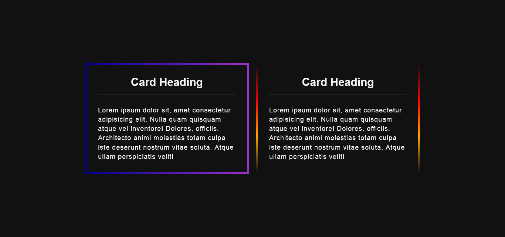

## GRABIENT BORDER

## Le challenge

Création de bordure avec dégradé de couleur

## Démonstration

Lien vers le projet : https://aperbet56.github.io/card_grabient/

## Projet développé avec

- Utilisation des balises sémantiques HTML5
- CSS3
- Flexbox
- Utilisation d'un normaliseur : le fichier normalize.css
- Desktop first
- Page web responsive
